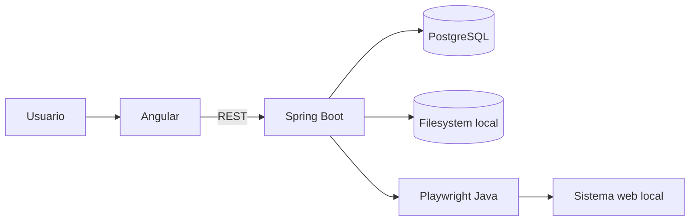
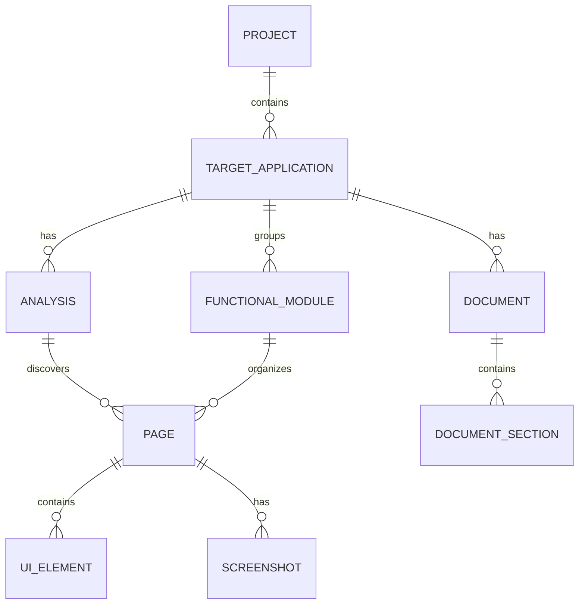

# SystemGuideForge
## Arquitectura del MVP

## 1. Decisión principal

SystemGuideForge será un Modular Monolith con frontend Angular separado, backend Spring Boot y arquitectura hexagonal pragmática. El MVP opera contra sistemas web locales y usa Playwright Java para el análisis seguro de solo lectura.

## 2. Arquitectura general



No hay integración de IA, DOCX ni workers distribuidos en el MVP.

## 3. Frontend

Tecnologías: Angular, TypeScript, Angular Material, Signals y RxJS cuando sea necesario.

```text
frontend/src/app/
├── core/
├── shared/
└── features/
    ├── systems/
    ├── access/
    ├── analysis/
    └── documents/
```

## 4. Backend

Tecnologías: Java, Spring Boot, Spring Web, Spring Data JPA y Bean Validation.

```text
backend/src/main/java/.../systemguideforge/
├── project/
├── targetapp/
├── access/
├── analysis/
├── crawler/
├── evidence/
├── documentation/
├── storage/
└── shared/
```

Cada módulo puede organizarse en `domain/`, `application/`, `infrastructure/` y `web/`.

## 5. Puertos y adaptadores

```text
BrowserAnalyzer
   └── PlaywrightBrowserAnalyzer

CredentialProtector
   └── ApplicationCredentialProtector

FileStorage
   └── LocalFileStorage
```

Los adaptadores externos quedan aislados del dominio. No se agrega un puerto de IA ni de renderizado DOCX hasta que esas capacidades entren en alcance.

## 6. Persistencia

PostgreSQL almacena proyectos, sistemas, configuraciones de acceso, análisis, pantallas, elementos, screenshots, módulos y documentos editables. Flyway gestiona las migraciones.

Las contraseñas se almacenan cifradas; el material descifrado solo vive durante la operación de acceso y nunca se persiste como evidencia.

## 7. Archivos

```text
storage/
└── screenshots/
```

El filesystem local es suficiente para el MVP. MinIO/S3 queda como evolución futura.

## 8. Modelo entidad-relación



## 9. Entidades principales

### PROJECT

`id`, `name`, `description`, `created_at`, `updated_at`.

### TARGET_APPLICATION

`id`, `project_id`, `name`, `base_url`, `login_url`, `username_encrypted`, `password_encrypted`, `excluded_routes_json`.

### ANALYSIS

`id`, `application_id`, `status`, `started_at`, `finished_at`, `pages_discovered`, `error_message`, `config_json`.

### PAGE

`id`, `analysis_id`, `url`, `normalized_url`, `title`, `inferred_name`, `module_name`, `fingerprint`, `depth`, `status`.

### UI_ELEMENT

`id`, `page_id`, `type`, `label`, `accessible_name`, `selector_hint`, `risk_level`, `metadata_json`.

### SCREENSHOT

`id`, `page_id`, `analysis_id`, `storage_path`, `sanitized`.

### DOCUMENT

`id`, `application_id`, `title`, `status`.

### DOCUMENT_SECTION

`id`, `document_id`, `title`, `content`, `sort_order`, `source_page_id`, `screenshot_id`.

## 10. Seguridad y límites

El navegador se ejecuta con contexto aislado y contra hosts locales autorizados. La clasificación de acciones usa tres estados: `SAFE`, `MUTATING` y `UNKNOWN`. Solo `SAFE` puede ejecutarse automáticamente; `MUTATING` y `UNKNOWN` se bloquean por defecto.

Las credenciales se excluyen de logs, screenshots, prompts y objetos de evidencia. No se incorpora IA al flujo MVP; cualquier integración futura deberá recibir evidencia previamente sanitizada.

## 11. Evolución futura

Cuando el MVP esté validado podrán evaluarse IA, workflows y captura guiada, exportación DOCX, sistemas de producción, almacenamiento remoto y procesamiento asíncrono. Ninguna de esas decisiones debe introducirse ahora en el diseño operativo del MVP.
