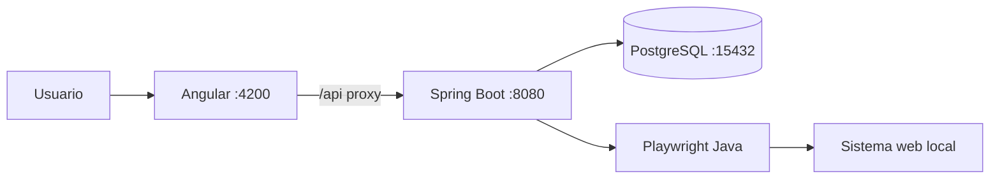
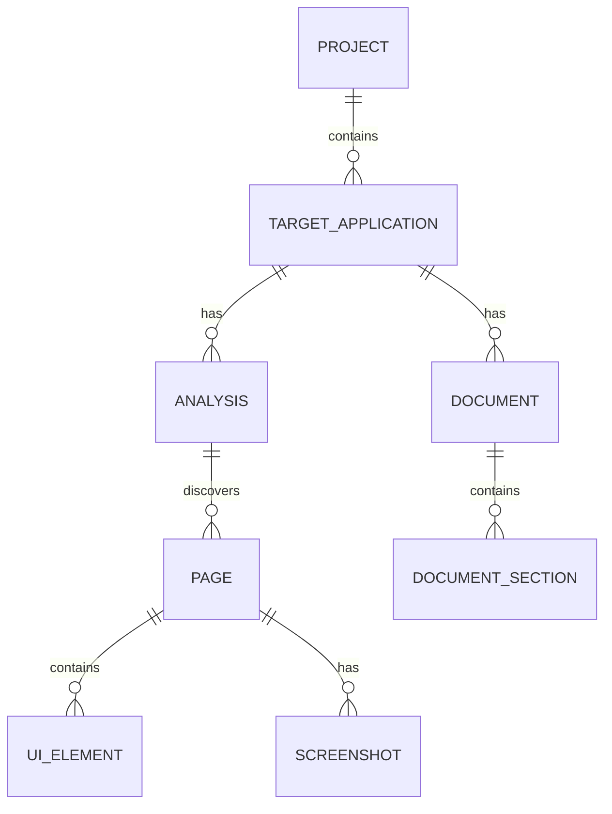

# SystemGuideForge
## Arquitectura implementada del MVP

## 1. Resumen

SGF es un monolito modular pragmático: un frontend Angular separado, un backend Spring Boot, PostgreSQL y un adaptador Playwright Java para análisis local de solo lectura. El análisis es síncrono; no hay workers distribuidos.



No se usa filesystem para screenshots: `ScreenshotRepository` persiste su contenido en una columna PostgreSQL `BYTEA`.

## 2. Frontend actual

El frontend usa Angular y TypeScript, sin Angular Material ni RxJS como dependencias del MVP. Sus áreas actuales son:

```text
frontend/src/app/
├── core/
└── features/
    ├── dashboard/
    ├── registration/
    └── analysis/
```

`proxy.conf.json` reenvía `/api` a `http://127.0.0.1:8080` durante `ng serve`.

## 3. Backend actual

El código implementado está organizado en tres paquetes principales:

```text
backend/src/main/java/com/systemguideforge/backend/
├── application/   # casos de uso, adaptadores de análisis y protección de credenciales
├── persistence/   # entidades JPA y repositorios
└── web/           # controladores REST
```

Esta es la estructura operativa actual. Una separación modular más profunda por dominio (`project`, `targetapp`, `analysis`, `documentation`, etc.) puede evaluarse como trabajo futuro, pero no describe el árbol implementado hoy.

## 4. Puertos y adaptadores

```text
ScreenAnalysisAdapter
└── PlaywrightScreenAnalysisAdapter

AccessProbe
├── PlaywrightAccessProbe
└── SocketAccessProbe

CredentialProtector
└── AesCredentialProtector

ScreenshotRepository
└── PostgreSQL/JPA
```

El adaptador de análisis se ejecuta de forma síncrona dentro del caso de uso. Solo se recorren enlaces con clasificación `SAFE`; los controles no se ejecutan. `MUTATING` y `UNKNOWN` se bloquean. La aprobación de inclusión de un elemento `UNKNOWN` es un dato documental independiente: no cambia la clasificación ni el comportamiento del crawler.

## 5. Persistencia y migraciones

`FunctionalModuleDeriver` deriva los módulos funcionales en memoria a partir de las páginas persistidas; los módulos derivados no se almacenan en PostgreSQL. PostgreSQL almacena las entidades y datos persistidos: proyectos, aplicaciones objetivo, análisis, páginas, elementos, screenshots y documentos editables. Las screenshots se almacenan como `BYTEA` mediante `ScreenshotRepository`, junto con su relación a página y análisis.

Flyway aplica esta historia, en orden:

| Migración | Propósito |
| --- | --- |
| V1 | Esquema inicial, incluyendo evidencia y screenshots |
| V2 | Esquema de documentos |
| V3 | Título del documento |
| V4 | Configuración del crawler |
| V5 | Idioma del documento |
| V6 | Tipo del documento |
| V7 | Aprobación de inclusión documental para elementos `UNKNOWN` |

Hibernate valida el esquema existente con `ddl-auto=validate`; no lo genera ni lo actualiza.

Las credenciales se almacenan cifradas. El material descifrado solo vive durante la operación correspondiente y no se persiste como evidencia.

## 6. Modelo principal



Las secciones del documento conservan referencias a la página y, cuando existe, a su screenshot de origen. Al cambiar una aprobación de inclusión documental, `AnalysisService` elimina el documento y sus secciones dentro de la transacción; la siguiente generación crea un borrador consistente con las aprobaciones actuales.

## 7. Límites y evolución

El MVP opera contra sistemas web locales autorizados, con login tradicional y navegación de solo lectura. No incluye IA, DOCX/PDF, workflows, producción, SSO/OAuth/MFA, colaboración, multiusuario, microservicios ni almacenamiento remoto.

La modularización futura, la ejecución asíncrona y los almacenamientos alternativos son posibles evoluciones, no capacidades actuales.
